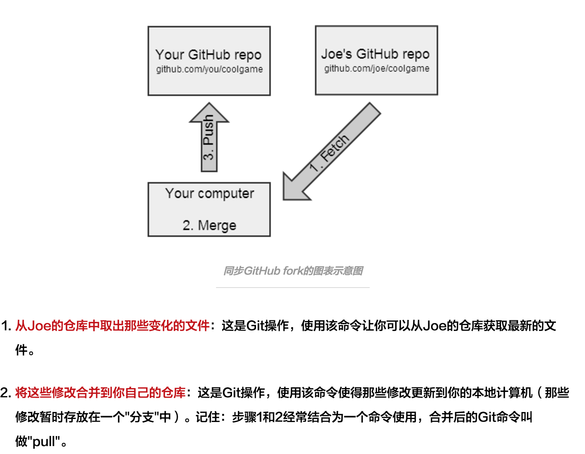

* git 的结构：
	* 工作区：也就是我们平时看到的文件
	* 暂存区：git add之后将改动存到暂存区
	* 本地版本库： 分支信息
	* 关于暂存区： git commit 之前都是不与具体分支关联的，举个例子，master与dev都是最新的，在dev分支修改某文件，添加到暂存区，然后切换到master分支去提交，这个提交算master分支的。
	* git checkout branch: 
		* git checkout 会用本地版本库中的分支替换工作区的内容。具体来说，当你执行git checkout 时，git 会判断切换分支和当前分支的关系，如果都是最新的，则工作区不变，暂存区也不变。就如上面的例子，没提交之前dev和master是一样的，所以checkout master时工作区不变。
		* checkout master时，如果dev和master不同，就会用master来替换工作区，同时清空暂存区，如果暂存区有在dev分支修改的文件，系统就会提示暂存区会清空，dev分支的修改无效，可以选择commit 或者stash。
	* git add
		* git add是将工作区的文件保存到暂存区，最好养成习惯，git add ,git commit -m '',不要直接git commit -a -m ''。因为git add可以分批次添加到暂存区。
	* git merge: 
		* merge冲突： 冲突原因：开始master和dev相同，后来master修改了A文件的第n行，dev修改了A文件的第

建立本地仓库--->修改本地文件--->commit到本地git--->sync到远程git

commit: 提交到本地git仓库   
sync(push):   同步到远端git仓库   
pull request(pr): 将自己的分支merge到另一个分支   
fork: 复制别人的仓库并创建一个branch(分支)    
pull: 将你fork的仓库中的同步到本地git中   
clone: 将自己远端git的项目(fork或自己建的)复制到本地git上

注意：

* commit 之后要sync
* 多人共同修改某个项目，为了避免冲突，最好先pull，同步一下最新的版本再提交自己的代码

在实际项目中，一般常用的git 操作一般为：

* git clone: 克隆一个仓库
* git branch: 查看本地分支
* git branch -a: 查看所有分支，本地和远程
* git fetch: 取回所有分支的更新
* git branch --set-upstream-to=origin/dev 
* git branch -d 本地分支：删除本地分支
* git difftool 分支1 分支2：用ksdiff查看diff
* git stash: 暂存不提交本地的改变

* git checkout -b 本地分支:新建一个本地分支并切换
* git commit -a -m 'fix bugs'
* git push 远程主机名  本地分支: refs/for/远程分支名(refs/for表示评审)
* 初始化一个分支的时候一般： git push -u origin master,表示设置默认主机为origin,没有远程分支会新建一个并且建立追踪关系，以后直接git push就行了。
* git push -u 远程主机名 本地分支 ：-u 设置默认主机
* git config --list查看git配置信息
* git branch -vv:查看分支对应关系
* git 不支持上传空目录，所以一般上传空目录的时候要在里面添加一个无用的文件.gitignore