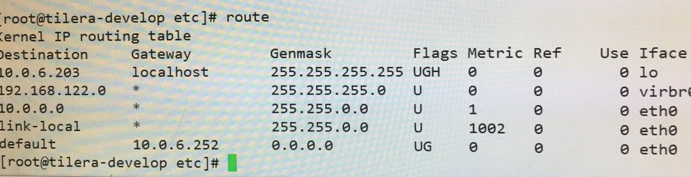

* 七层协议中，上一层对下一次是封装好的，比如tcp头，ip头对数据链路层来说都是一样的，都当成普通的报文来处理。

* 在arp协议解析的时候，主机和路由器地位是等价的，主机(路由器)发送广播，ip符合条件的主机(路由器)接收消息，发送个回应，从而让发送方确定目的地址的mac地址。所以在硬件层面，不管是主机还是路由器，都是通过mac地址发送的。

* arp表，存在电脑中，是当前局域网内ip和mac地址的对应表，一般来说，是通过ip查到mac地址，查不到才用到上面所说的确定mac地址，确定后就记录到当前的arp表中。

* 内网，外网，一般来说ipconfig查到的都是内网ip，转换成外网ip要
经过NAT地址转换,判断内网ip的方法是：     
10.xxx.xxx.xxx                               
192.168.xxx.xxx     
172.16.0.0-172.31.255.255

* 主机或者路由器在转发的时候先查route表，再查arp表                              

先把目的ip和mask做&，然后选择路由        
eg1: 10.0.6.86, 符合第三条，Flags没有G，就是没有网关(属于同一局域网)，从eth0(网卡接口，一台计算机可能有多个网卡)出;然后再查arp表，找到了就直接发走，找不到发送广播(从eth0口)找到目的主机，再发出去。                                  
eg2: 10.0.6.203，这个比较特殊(localhost优先级高)通过lo发到本地环回     
eg3: 匹配不到，选择default网关，从eth0口出，然后网关再负责转发，网关就是局域网的出口。

* 在手动设置网络时，需要设置ip,子网掩码，dns地址，默认网关。
	* 子网掩码：不用设置，按照DHCP的设置，因为DHCP表示的是这个局域网的大小，你没法改变。比如说一个路由器下的局域网的子网掩码为255.255.255.0，表示这是一个C类地址，子网内有255个主机。
	* ip和默认网关，这个可以改，但是需要在一定的范围内改，先用默认网关&子网掩码，可以得到网段，这部分你不能改，你只能改后面的主机。比如默认网关为192.168.1.1,子网掩码为255.255.255.0,则网段为192.168.1.x;x可以从0-255之间你随便改。
	* NAT地址转换: 
		* 根据dst_ip区分
		* dst ip+src port区分
		* 需要对src_ip也做一个nat
		* [参考资料](http://www.cnblogs.com/wbxjiayou/p/5150753.html)

* http：url和uri的区别：
	* url: universal resource location,我们通常见到的链接都是,url是uri的一种
	* uri: universal resource identifier,能够标识一个东西的很多，不一定是url